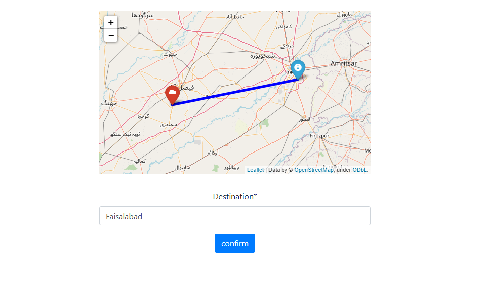

<div align="center">
<h1>Django Geolocation Distance Measurement</h1>


<br>
<br>
</div>
<hr>
<h4>A django app to calculate distance between two points with folium maps and matrics<h4>

### Screenshot


## Installation steps

Clone the Repo and install the requirements

```
git clone https://github.com/saadhaxxan/Django-Geolocation-Distance-Measurement.git
cd Django-Geolocation-Distance-Measurement
pip install -r requirements.txt
```
### Get Geodatabases from Maxmindb
 - [Get from Here](https://www.maxmind.com/en/accounts/549107/geoip/downloads)
 - Paste them to geoip folder 
 - run the application

```
python manage.py makemigrations
python manage.py migrate
python manage.py runserver
```

## Integrate into an Existing Application

### Add into installed Apps
```
INSTALLED_APPS = [
    'django.contrib.admin',
    'django.contrib.auth',
    'django.contrib.contenttypes',
    'django.contrib.sessions',
    'django.contrib.messages',
    'django.contrib.staticfiles',
    'measurements',
]
```

## Author
You can get in touch with me on my LinkedIn Profile:

#### Saad Hassan
[](https://www.linkedin.com/in/saadhaxxan)

You can also follow my GitHub Profile to stay updated about my latest projects: [](https://github.com/saadhaxxan)

If you liked the repo then kindly support it by giving it a star ⭐!

## Contributions Welcome
[](#)

If you find any bug in the code or have any improvements in mind then feel free to generate a pull request.

